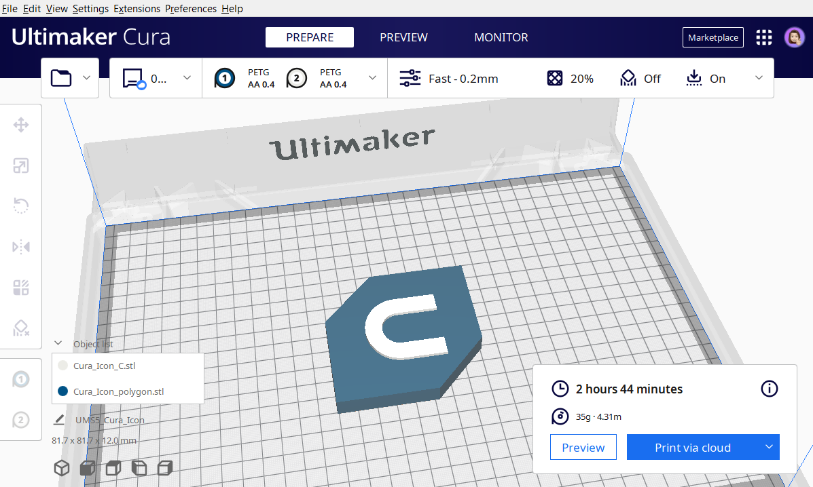

# Cura

    
    
    
    
    
    
    
    

Ultimaker Cura is a state-of-the-art slicer application to prepare your 3D models for printing with a 3D printer. With hundreds of settings
and hundreds of community-managed print profiles, Ultimaker Cura is sure to lead your next project to a success.

## Logging Issues

For crashes and similar issues, please attach the following information:

* (On Windows) The log as produced by dxdiag (start -> run -> dxdiag -> save output)
* The Cura GUI log file, located at
    * `%APPDATA%\cura\<Cura version>\cura.log` (Windows), or usually `C:\Users\<your username>\AppData\Roaming\cura\<Cura version>\cura.log`
    * `$HOME/Library/Application Support/cura/<Cura version>/cura.log` (OSX)
    * `$HOME/.local/share/cura/<Cura version>/cura.log` (Ubuntu/Linux)

If the Cura user interface still starts, you can also reach this directory from the application menu in Help -> Show settings folder.
An alternative is to install the [ExtensiveSupportLogging plugin](https://marketplace.ultimaker.com/app/cura/plugins/UltimakerPackages/ExtensiveSupportLogging)
this creates a zip folder of the relevant log files. If you're experiencing performance issues, we might ask you to connect the CPU profiler
in this plugin and attach the collected data to your support ticket. 

## Running from Source
Please check our [Wiki page](https://github.com/Ultimaker/Cura/wiki/Running-Cura-from-Source) for details about running Cura from source.

## Plugins
Please check our [Wiki page](https://github.com/Ultimaker/Cura/wiki/Plugin-Directory) for details about creating and using plugins.

## Supported printers
Please check our [Wiki page](https://github.com/Ultimaker/Cura/wiki/Adding-new-machine-profiles-to-Cura) for guidelines about adding support
for new machines.

## Configuring Cura
Please check out [Wiki page](https://github.com/Ultimaker/Cura/wiki/Cura-Settings) about configuration options for developers.

## Translating Cura
Please check out [Wiki page](https://github.com/Ultimaker/Cura/wiki/Translating-Cura) about how to translate Cura into other languages.

## License
  
Cura is released under terms of the LGPLv3 or higher. A copy of this license should be included with the software. Terms of the license can be found in the LICENSE file. Or at
http://www.gnu.org/licenses/lgpl.html

> But in general it boils down to:  
> **You need to share the source of any Cura modifications**
